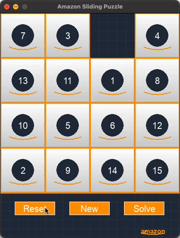

# sliding-puzzle
Amazon Q Developer CLI を使ってゲームを作成してみる

[Amazon Q CLI でゲームを作ろう Tシャツキャンペーン](https://aws.amazon.com/jp/blogs/news/build-games-with-amazon-q-cli-and-score-a-t-shirt/)

## 実行方法

1. 必要なライブラリをインストール:
```bash
pip install -r requirements.txt
```


2. ゲームを実行:
```bash
python3 main.py
```

## 操作方法

- **マウス**: タイルをクリックして移動
- **キーボード**: 矢印キーまたはWASDキーで移動
- **R**: 新しいパズルを生成
- **ESC**: ゲーム終了
- **画面下部のボタン**:
  - **リセット**: 現在のパズルを初期状態に戻す
  - **新規**: 新しいパズルを生成
  - **解く**: パズルを自動的に解く



